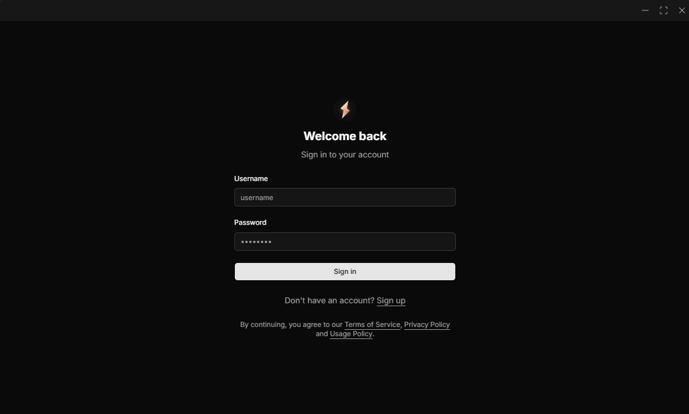
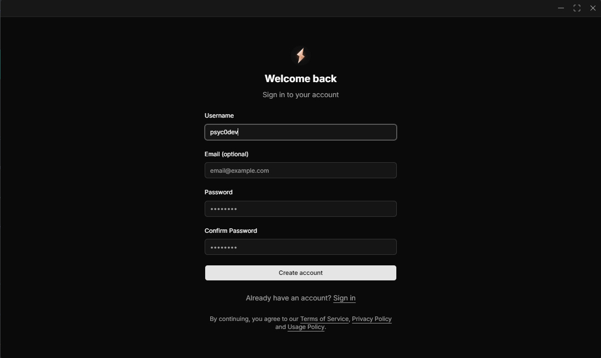
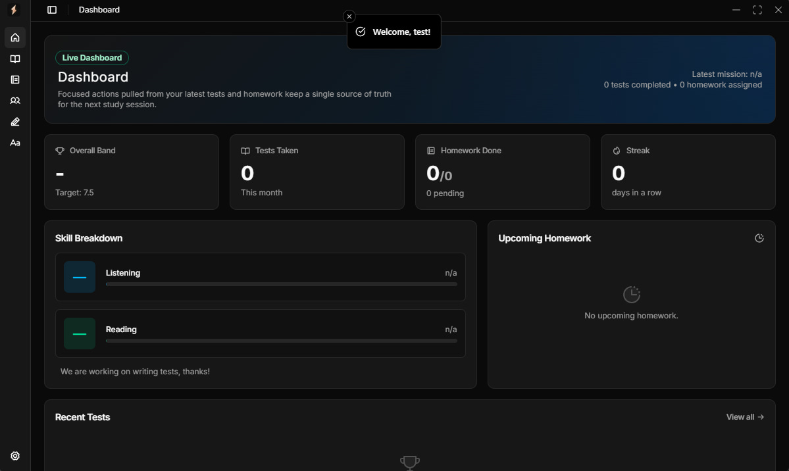
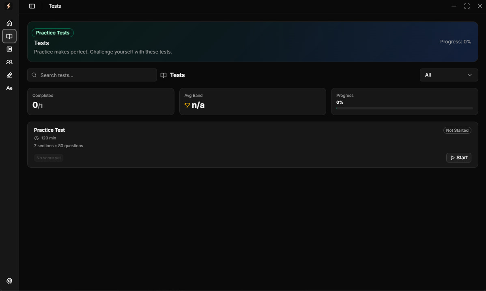
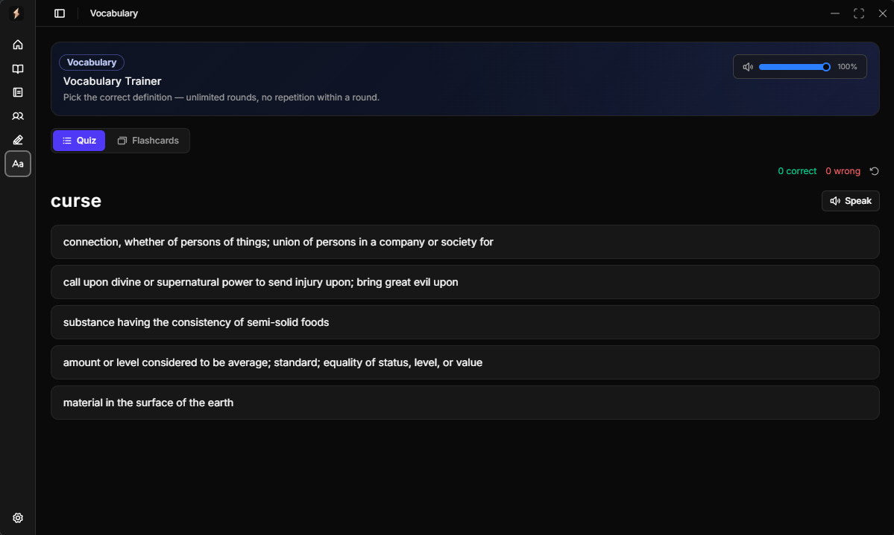
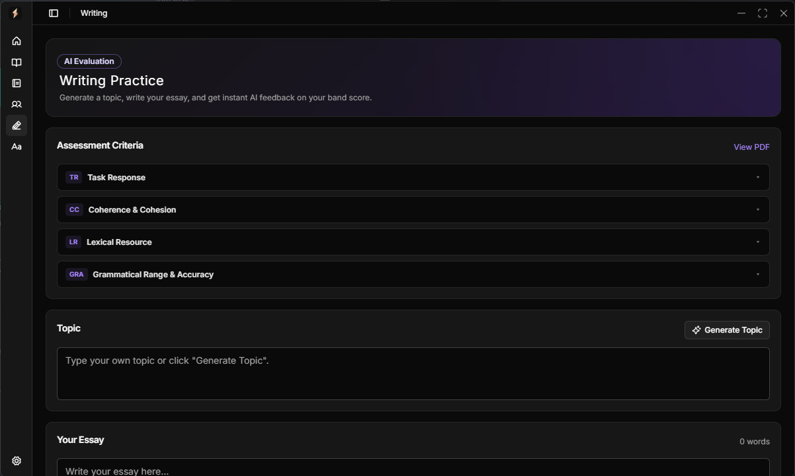
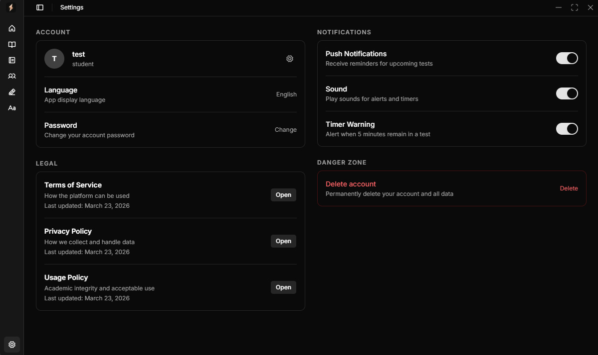
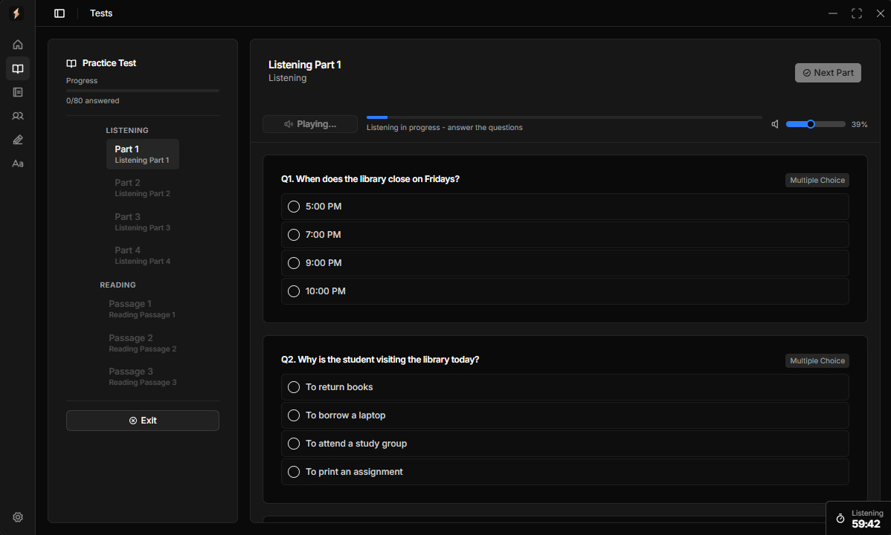

# extra IELTS

IELTS preparation platform — timed practice tests, AI writing evaluation, vocabulary,
and teacher-managed groups — delivered as a Tauri desktop application and a web app
that share a single React frontend and a single Hono backend.

- **Product name:** extra IELTS
- **Bundle identifier:** `com.psyc0dev.ielts`
- **Stack:** React 19 · Tauri 2 · Hono · Cloudflare Workers · D1 · Durable Objects
- **Runtime (local):** Bun
- **Runtime (production):** Cloudflare Workers
- **Status:** In development

---

## Screenshots

<div align="center">

<a href="images/photo_1_2026-08-20_17-51-01.jpg"></a>
<a href="images/photo_2_2026-08-20_17-51-01.jpg"></a>
<a href="images/photo_3_2026-08-20_17-51-01.jpg"></a>
<a href="images/photo_4_2026-08-20_17-51-01.jpg"></a>
<a href="images/photo_5_2026-08-20_17-51-01.jpg"></a>
<a href="images/photo_6_2026-08-20_17-51-01.jpg"></a>
<a href="images/photo_7_2026-08-20_17-51-01.jpg"></a>
<a href="images/photo_8_2026-08-20_17-51-01.jpg"></a>
<a href="images/photo_9_2026-08-20_17-51-01.jpg"></a>

</div>

---

## Table of Contents

1. [Overview](#1-overview)
2. [Architecture](#2-architecture)
3. [Repository Layout](#3-repository-layout)
4. [Data Model (D1 / SQLite)](#4-data-model-d1--sqlite)
5. [Backend API](#5-backend-api)
6. [Real-time: WebSockets & Durable Objects](#6-real-time-websockets--durable-objects)
7. [Frontend Application](#7-frontend-application)
8. [Tauri Desktop Shell](#8-tauri-desktop-shell)
9. [AI Services](#9-ai-services)
10. [Configuration](#10-configuration)
11. [Development Setup](#11-development-setup)
12. [Build & Deploy](#12-build--deploy)
13. [Scripts Reference](#13-scripts-reference)
14. [Security & Hardening](#14-security--hardening)

---

## 1. Overview

extra IELTS is an end-to-end study system for IELTS candidates and the instructors
who manage them. A student logs in, sees a live dashboard, takes timed tests, submits
writing for AI scoring, drills vocabulary, and receives homework from teachers. Teachers
and admins manage users, author tests, build groups, assign work, and chat with students
in real time.

The defining architectural choice is a **single Hono application** that runs unchanged in
two environments:

- **Local development** — served by Bun over `bun:sqlite`, mirroring the D1 interface.
- **Production** — deployed to Cloudflare Workers with a real D1 database, Durable
  Objects for websockets, and Hugging Face Spaces for AI.

Because the API surface is identical, there is no second "server" codebase to diverge.

---

## 2. Architecture

```
┌─────────────────────────────┐         ┌──────────────────────────────────┐
│  Tauri 2 Desktop Shell      │         │  Web (any browser)               │
│  ┌───────────────────────┐  │         │  ┌────────────────────────────┐  │
│  │ React 19 SPA (Vite)  │  │         │  │ React 19 SPA (same build)  │  │
│  │  shadcn/ui · Tailwind│  │         │  │                            │  │
│  └───────────┬───────────┘  │         │  └─────────────┬──────────────┘  │
│  msedge-tts  │ notification │         │                │                  │
└──────────────┼──────────────┘         └────────────────┼─────────────────┘
               │ HTTPS + WebSocket (token in query)        │
               ▼                                           ▼
┌──────────────────────────────────────────────────────────────────────────┐
│  Hono API  (Bun / Cloudflare Workers — same code)                          │
│   auth · account · tests · assignments · writing · vocabulary · settings   │
│   admin · health · groups + presence/chat websockets                       │
└───┬───────────┬───────────────┬───────────────┬───────────────────────────┘
    │           │               │               │
    ▼           ▼               ▼               ▼
 ┌──────┐  ┌─────────┐   ┌────────────┐   ┌──────────────────────┐
 │  D1  │  │ Durable │   │ Hugging    │   │ CORS / JWT / Rate     │
 │(SQL) │  │ Objects │   │ Face Spaces│   │ limit (CacheStore)    │
 └──────┘  └─────────┘   └────────────┘   └──────────────────────┘
            (chat, presence)
```

**Request flow**

1. SPA calls `/api/*`. In Tauri, requests resolve to the API base (`VITE_API_BASE_URL`,
   default `/api` proxied locally).
2. CORS middleware allows origins from `CORS_ORIGIN` (comma-separated). The default
   allow-list is `tauri://localhost, https://tauri.localhost, http://localhost:1420`.
3. A global rate limiter caps each client at **120 requests / 60s** using a `CacheStore`.
4. Authenticated routes verify a JWT (`HS256`) and may issue refresh tokens
   (`refresh_tokens` table).
5. WebSocket upgrades (`/api/groups/:id/ws`, `/api/presence/ws`) bypass CORS and the
   rate limiter; they verify the JWT, check group membership, and hand the request to a
   Durable Object.

---

## 3. Repository Layout

```
extra-ielts/
├── ai/                         # Hugging Face AI model sources (evaluator, generator)
│   ├── extra-ai-evaluator/
│   └── extra-ai-generator/
├── images/                     # Screenshots / showcase media
├── server/                     # Hono backend (single codebase)
│   ├── lib/
│   │   ├── types.ts            # AppEnv, Bindings, shared types
│   │   ├── store.ts            # D1 access helpers (users, cache, JWT secret)
│   │   ├── schemas.ts          # zod request/response schemas
│   │   ├── tests.ts            # test/section helpers
│   │   ├── ChatWebSocket.ts    # Durable Object: group chat
│   │   └── PresenceWebSocket.ts# Durable Object: app presence
│   ├── migrations/             # D1 SQL migrations (0001 → 0017)
│   ├── routes/                 # Hono route modules
│   │   ├── auth.ts
│   │   ├── account.ts
│   │   ├── tests.ts
│   │   ├── assignments.ts
│   │   ├── writing.ts
│   │   ├── vocabulary.ts
│   │   ├── settings.ts
│   │   ├── admin.ts
│   │   └── health.ts
│   ├── app.ts                  # builds the Hono app, CORS, rate limit, WS routes
│   ├── bun.ts                  # Bun entry: sqlite migrations + serve
│   ├── worker.ts               # Cloudflare Workers entry
│   └── dev-db.ts               # local D1-over-bun:sqlite shim
├── src/                        # React 19 SPA
│   ├── components/             # ui/ (shadcn), animate-ui/, test-runner/, app components
│   ├── hooks/                  # use-auth, use-nav, use-timer, use-mobile, ...
│   ├── lib/                    # api.ts, tts.ts, notify.ts, sound.ts, utils.ts, vocabulary-api.ts
│   ├── locales/                # en.ts (and other locale files)
│   ├── pages/                  # Dashboard, Tests, Homework, Writing, Vocabulary,
│   │                           #   Groups, Settings, Admin, NotFound
│   ├── assets/                 # static assets, .lottie animations
│   ├── sounds/                 # audio assets
│   ├── App.tsx                 # shell: sidebar, window controls, routing, websockets
│   ├── main.tsx                # entry (frameless window bootstrap, dark class)
│   ├── index.css               # Tailwind + theme tokens
│   └── vite-env.d.ts
├── src-tauri/                  # Rust/Tauri shell
│   ├── src/main.rs
│   ├── capabilities/           # permission sets
│   ├── icons/                  # platform icons
│   ├── gen/                    # generated bindings
│   ├── Cargo.toml
│   ├── build.rs
│   └── tauri.conf.json
├── .babelrc                    # babel for react preset (Tauri/legacy interop)
├── components.json             # shadcn registry config
├── index.html                  # Vite HTML entry
├── obfuscation.config.ts       # JS obfuscation options (release builds)
├── vite.config.ts              # Vite + Tailwind v4 + obfuscation + compression
├── wrangler.jsonc              # Cloudflare Workers + D1 + Durable Objects config
└── package.json
```

---

## 4. Data Model (D1 / SQLite)

All tables are created by ordered SQL migrations under `server/migrations/`. The local
Bun runtime applies them to a `bun:sqlite` file; production applies them to D1.

### 4.1 `users`

| column              | type    | notes                                               |
|---------------------|---------|-----------------------------------------------------|
| `id`                | TEXT PK | UUID                                                 |
| `username`          | TEXT    | UNIQUE, NOT NULL                                    |
| `email`             | TEXT    | UNIQUE (nullable)                                   |
| `role`              | TEXT    | CHECK IN ('admin','teacher','student')              |
| `password_hash`     | TEXT    | bcrypt-style hash, NOT NULL                         |
| `avatar_url`        | TEXT    | nullable                                            |
| `created_at`        | TEXT    | ISO timestamp                                       |
| `password_changed_at` | TEXT  | used to invalidate refresh tokens on password change|

### 4.2 `tests`

| column            | type | notes                                               |
|-------------------|------|-----------------------------------------------------|
| `id`              | TEXT PK |                                                   |
| `title`           | TEXT | NOT NULL                                           |
| `duration_minutes`| INT  | NOT NULL                                           |
| `published`       | INT  | 0/1, default 0                                     |
| `sections_json`   | TEXT | JSON-encoded sections configuration                |
| `created_at`      | TEXT | NOT NULL                                           |

### 4.3 `assignments`

| column             | type | notes                                              |
|--------------------|------|----------------------------------------------------|
| `id`               | TEXT PK |                                                  |
| `type`             | TEXT | CHECK IN ('task','homework')                       |
| `test_id`          | TEXT | FK → tests(id) CASCADE                             |
| `section_kinds_json`| TEXT| JSON list of section kinds                         |
| `assigned_to`      | TEXT | FK → users(id) CASCADE                             |
| `assigned_by`      | TEXT | FK → users(id) CASCADE                             |
| `due_at`           | TEXT | nullable due date                                  |
| `created_at`       | TEXT | NOT NULL                                           |

### 4.4 `attempts`

| column            | type | notes                                              |
|-------------------|------|----------------------------------------------------|
| `id`              | TEXT PK |                                                  |
| `assignment_id`   | TEXT | FK → assignments(id) CASCADE                       |
| `test_id`         | TEXT | FK → tests(id) CASCADE                             |
| `user_id`         | TEXT | FK → users(id) CASCADE                             |
| `status`          | TEXT | CHECK IN ('in-progress','completed')               |
| `score_total`     | INT  | nullable                                           |
| `band`            | REAL | overall band score                                 |
| `reading_band`    | REAL | per-skill band                                     |
| `listening_band`  | REAL | per-skill band                                     |
| `started_at`      | TEXT | NOT NULL                                           |
| `completed_at`    | TEXT | nullable                                           |
| `responses_json`  | TEXT | JSON of student responses                          |

### 4.5 `groups` / `group_members`

```sql
groups ( id TEXT PK, name TEXT NOT NULL, created_at TEXT NOT NULL,
         owner_user_id TEXT REFERENCES users(id) ON DELETE SET NULL )
group_members ( group_id TEXT, user_id TEXT,
                PRIMARY KEY(group_id, user_id),
                FK group_id→groups CASCADE, FK user_id→users CASCADE )
```

### 4.6 `group_invitations`

| column       | type | notes                                         |
|--------------|------|-----------------------------------------------|
| `id`         | TEXT PK |                                             |
| `group_id`   | TEXT | FK → groups(id) CASCADE                      |
| `user_id`    | TEXT | FK → users(id) CASCADE                       |
| `invited_by` | TEXT | FK → users(id) CASCADE                       |
| `status`     | TEXT | CHECK IN ('pending','accepted','declined')   |
| `created_at` | TEXT | NOT NULL                                     |

### 4.7 `group_messages` / `group_message_seen`

```sql
group_messages ( id TEXT PK, group_id TEXT, user_id TEXT,
                 content TEXT NOT NULL, created_at TEXT NOT NULL,
                 reply_to_id TEXT,
                 FK group_id→groups CASCADE, FK user_id→users CASCADE )
-- index on (group_id, created_at); secondary index on reply_to_id

group_message_seen ( message_id TEXT, user_id TEXT, seen_at TEXT NOT NULL,
                     PRIMARY KEY(message_id, user_id),
                     FK message_id→group_messages CASCADE,
                     FK user_id→users CASCADE )
```

### 4.8 `writing_submissions`

| column          | type | notes                                         |
|-----------------|------|-----------------------------------------------|
| `id`            | TEXT PK |                                             |
| `user_id`       | TEXT | FK → users(id) CASCADE                       |
| `topic`         | TEXT | NOT NULL                                     |
| `essay`         | TEXT | NOT NULL                                     |
| `word_count`    | INT  | default 0                                    |
| `overall_score` | REAL | nullable AI score                            |
| `overall_label` | TEXT | nullable band label                          |
| `penalty`       | REAL | default 0                                    |
| `criteria_json` | TEXT | JSON of per-criterion scores                 |
| `created_at`    | TEXT | default now()                                |

Index on `(user_id, created_at DESC)`.

### 4.9 `otp_tokens` / `otp_attempts`

```sql
otp_tokens ( otp TEXT PK, user_id TEXT, expires_at INT NOT NULL,
             FK user_id→users CASCADE )
otp_attempts ( id INTEGER PK AUTOINCREMENT, ip TEXT, attempted_at INT )
-- index on (ip, attempted_at)
```

Used for email/account verification flows and brute-force protection.

### 4.10 `refresh_tokens`

| column        | type | notes                                    |
|---------------|------|------------------------------------------|
| `id`          | TEXT PK |                                        |
| `user_id`     | TEXT | FK → users(id) CASCADE                  |
| `token_hash`  | TEXT | stored hash (not raw token)             |
| `expires_at`  | INT  | unix ms                                 |
| `created_at`  | TEXT | NOT NULL                                |

Indexes on `(user_id)` and `(token_hash)`.

---

## 5. Backend API

All routes are mounted under `/api`. The Hono `api` sub-app receives CORS + rate-limit
middleware; the top-level `app` also exposes two WebSocket routes outside that middleware.

### 5.1 Auth — `auth.ts`

| Method | Path            | Purpose                                   |
|--------|-----------------|-------------------------------------------|
| POST   | `/api/auth/register` | Create account (student)               |
| POST   | `/api/auth/login`    | Password login → access + refresh JWT  |
| POST   | `/api/auth/refresh`  | Rotate access token via refresh token  |
| POST   | `/api/auth/logout`   | Revoke refresh token                    |
| GET    | `/api/auth/me`       | Current user profile from JWT          |

Passwords are hashed; `password_changed_at` is compared against token `iat` so a password
reset invalidates outstanding refresh tokens.

### 5.2 Account — `account.ts`

| Method | Path               | Purpose                          |
|--------|--------------------|----------------------------------|
| GET    | `/api/account`     | Read profile                     |
| PATCH  | `/api/account`     | Update profile                   |
| POST   | `/api/account/password` | Change password              |
| POST   | `/api/account/avatar`   | Upload/set avatar URL         |

### 5.3 Tests — `tests.ts`

| Method | Path              | Purpose                          |
|--------|-------------------|----------------------------------|
| GET    | `/api/tests`      | List published tests             |
| GET    | `/api/tests/:testId` | Fetch a test + sections        |

### 5.4 Assignments — `assignments.ts`

| Method | Path                                 | Purpose                          |
|--------|--------------------------------------|----------------------------------|
| GET    | `/api/assignments`                   | List assignments for current user|
| GET    | `/api/assignments/:id/attempts`      | Attempts on an assignment        |
| GET    | `/api/assignments/attempts/:attemptId` | Single attempt detail         |
| PUT    | `/api/assignments/attempts/:attemptId/answers` | Save responses          |
| POST   | `/api/assignments/attempts/:attemptId` | Finalize / score attempt     |
| GET    | `/api/assignments/tests/:testId/attempts` | Attempts for a test         |

### 5.5 Writing — `writing.ts`

| Method | Path                    | Purpose                                |
|--------|-------------------------|----------------------------------------|
| POST   | `/api/writing/topic`    | Generate a writing prompt (AI)         |
| POST   | `/api/writing/evaluations` | Submit essay → AI evaluation        |
| GET    | `/api/writing/history`  | List past submissions                  |
| GET    | `/api/writing/history/:id` | Single submission detail             |

### 5.6 Vocabulary — `vocabulary.ts`

| Method | Path                    | Purpose                                |
|--------|-------------------------|----------------------------------------|
| GET    | `/api/vocabulary`       | List vocabulary sets                   |
| GET    | `/api/vocabulary/test`  | Vocabulary test/quiz                   |
| GET    | `/api/vocabulary/dictionary/:word` | Dictionary lookup              |
| GET    | `/api/vocabulary/similar/:word`  | Similar-word lookup             |

### 5.7 Settings — `settings.ts`

| Method | Path           | Purpose                  |
|--------|----------------|--------------------------|
| GET    | `/api/settings`  | Read user settings       |
| PUT    | `/api/settings`  | Update user settings     |

Settings include notifications, sound, and timer warnings.

### 5.8 Health — `health.ts`

| Method | Path             | Purpose                     |
|--------|------------------|-----------------------------|
| GET    | `/api/health`    | Liveness                    |
| GET    | `/api/db/health` | DB connectivity check       |

### 5.9 Admin — `admin.ts`

Admin/teacher-only. Covers users, tests, assignments, groups, invitations, and member
management. Key routes:

```
GET    /api/admin/users
POST   /api/admin/users/lookup
POST   /api/admin/tests
GET    /api/admin/tests
PUT    /api/admin/tests/:testId
DELETE /api/admin/tests/:testId
GET    /api/admin/tests/:testId/download
POST   /api/admin/assignments
GET    /api/admin/assignments
POST   /api/admin/groups
GET    /api/admin/groups
DELETE /api/admin/groups/:groupId
POST   /api/admin/groups/:groupId/members
DELETE /api/admin/groups/:groupId/members/:userId
GET    /api/admin/groups/:groupId/assignments
GET    /api/admin/users/:userId/stats
GET    /api/admin/groups/:groupId/invitations
POST   /api/admin/groups/:groupId/invitations
GET    /api/invitations
POST   /api/invitations/:invitationId          # accept/decline
POST   /api/groups/:groupId/leave
GET    /api/groups/:groupId/messages
POST   /api/groups/:groupId/messages
POST   /api/groups/:groupId/messages/:messageId/seen
```

---

## 6. Real-time: WebSockets & Durable Objects

Two Durable Object classes are declared in `wrangler.jsonc`:

- **`CHAT_ROOM`** → `ChatWebSocket` (class `ChatWebSocket`)
- **`APP_PRESENCE`** → `PresenceWebSocket` (class `PresenceWebSocket`)

### 6.1 Group chat — `/api/groups/:groupId/ws`

- Verifies JWT, loads the user, and checks `group_members` membership (or teacher/admin).
- Uses `CHAT_ROOM.idFromName(groupId)` so each group has one sticky chat instance.
- Forwards `userId` + `username` as query params to the DO.
- The DO relays messages, tracks `reply_to_id`, and records seen state
  (`group_message_seen`).

### 6.2 Presence — `/api/presence/ws`

- Single instance via `APP_PRESENCE.idFromName('app')`.
- Tracks which users are currently online across the whole app, broadcast on change.

Both WS routes are registered at the top level of the Hono app, **outside** the CORS and
rate-limit middleware, with their own auth checks.

---

## 7. Frontend Application

The SPA is a React 19 + TypeScript app built with Vite. UI is shadcn/ui on top of Radix
primitives, styled with Tailwind CSS v4. Animations use `motion`; data viz uses
`recharts`; toasts use `sonner`.

### 7.1 Pages

| Route/page        | File                  | Responsibility                          |
|-------------------|-----------------------|-----------------------------------------|
| Dashboard         | `pages/dashboard.tsx` | Overview: stats, skill breakdown, homework, recent tests, invitations |
| Tests             | `pages/tests.tsx`     | Browse published tests                  |
| Homework          | `pages/homework.tsx`  | Assigned work + status                  |
| Writing           | `pages/writing.tsx`   | AI essay evaluation                     |
| Vocabulary        | `pages/vocabulary.tsx`| Word sets + practice                    |
| Groups            | `pages/groups.tsx`    | Group chat, members, invitations        |
| Settings          | `pages/settings.tsx`  | Notifications, sound, timer prefs       |
| Admin             | `pages/admin.tsx`     | User/test/group management              |
| NotFound          | `pages/not-found.tsx` | 404                                     |

### 7.2 Core components

- `App.tsx` — shell: sidebar (`SidebarProvider`), breadcrumb, custom `WindowControls`
  (frameless window), `TimerWidget`, page routing through `useNav`, and WebSocket wiring
  (`getWsToken`, `buildWebSocketUrl`).
- `Navbar.tsx` — top navigation + search (`cmdk`).
- `components/WindowControls.tsx` — minimize/maximize/close for the transparent window.
- `components/TestRunner.tsx`, `test-builder.tsx`, `QuestionInputs.tsx` — exam engine.
- `components/TimerWidget.tsx` — persistent countdown.

### 7.3 Hooks

`use-auth` (session/role state), `use-nav` (active page), `use-timer`, `use-mobile`,
`use-sidebar`, `use-controlled-state`, `use-delayed-loading`.

### 7.4 Libraries (`src/lib`)

- `api.ts` — typed API client (auth, tests, assignments, groups, websocket token).
- `vocabulary-api.ts` — vocabulary endpoints.
- `tts.ts` — text-to-speech bridge (Rust `msedge-tts` via Tauri plugin).
- `notify.ts` — desktop notifications (Tauri plugin).
- `sound.ts` — audio playback.
- `utils.ts` — small helpers (`cn`, formatters).

### 7.5 Internationalization

Locale strings live under `src/locales/` (`en.ts`). Keys are grouped by page
(`dashboard`, `tests`, `homework`, `writing`, `vocabulary`, `groups`, `admin`, `settings`,
`login`, `legal`, `timer`, `testRunner`, `windowControls`, `testBuilder` …).

---

## 8. Tauri Desktop Shell

`src-tauri/` holds the Rust application.

- **`Cargo.toml`** dependencies: `tauri`, `tauri-plugin-notification`,
  `tauri-plugin-shell`, `serde`, `serde_json`, `msedge-tts`, `base64`.
- **Window** (`tauri.conf.json`): 1200×720, not resizable, no decorations, transparent —
  the custom `WindowControls` and rounded UI provide the chrome.
- **Release profile:** `opt-level=3`, `lto="thin"`, `codegen-units=1`, `panic="abort"`,
  `strip=true`, no debug symbols.
- **Plugins:** notifications, shell.
- **TTS:** `msedge-tts` runs native in Rust and is exposed to the frontend over the
  Tauri invoke bridge (`src/lib/tts.ts`).

---

## 9. AI Services

AI is served by Hugging Face Spaces, referenced via environment variables in
`wrangler.jsonc`:

- `EVALUATOR_URL` → `https://extra-corporation-extraai.hf.space`
  (writing evaluation/scoring)
- `GENERATOR_URL` → `https://extra-corporation-extra-ai-generator.hf.space`
  (writing topic generation, vocabulary helpers)

The model sources live in `ai/extra-ai-evaluator/` and `ai/extra-ai-generator/`. Writing
submissions are scored and stored in `writing_submissions` with an overall band, label,
penalty, and per-criterion JSON.

---

## 10. Configuration

### 10.1 `.env` (local, consumed by `server/bun.ts` / Vite)

Required keys include `JWT_SECRET`, `D1-equivalent` connection via `DEV_DB_PATH`,
`CORS_ORIGIN`, `EVALUATOR_URL`, `GENERATOR_URL`, `RESEND_API_KEY`, `RESEND_FROM`, `PORT`.
A `JWT_SECRET` is **required** for the Bun server to start.

### 10.2 `wrangler.jsonc` (production bindings)

- `name: api`, entry `server/worker.ts`, `compatibility_date: 2026-03-01`,
  `compatibility_flags: ["nodejs_compat"]`.
- `d1_databases`: `DB` → `extra-db` (id `b10c9082-…`), `migrations_dir: ./server/migrations`.
- `durable_objects`: `CHAT_ROOM` → `ChatWebSocket`, `APP_PRESENCE` → `PresenceWebSocket`,
  with migration tags matching the class renames.
- `vars`: `CORS_ORIGIN`, `EVALUATOR_URL`, `GENERATOR_URL`, `RESEND_FROM`.

### 10.3 Vite

`vite.config.ts` configures:

- Dev server on port **1420** (`strictPort`), ignoring `server/` and `src-tauri/`.
- **Production hardening:** `rollup-plugin-obfuscator`, Tailwind class mangling
  (`unplugin-tailwindcss-mangle`), gzip + brotli compression, `@` → `./src` alias,
  manual vendor chunking (`react-core`, `ui-vendor`, `icons`, `vendor`), and
  `esbuild` console/debugger `drop` in production.
- `obfuscation.config.ts` holds the obfuscator options.

---

## 11. Development Setup

Prerequisites: **Bun**, the **Rust toolchain** (for Tauri), and **Wrangler** (for
Cloudflare deploys).

```bash
# 1. Install JS/TS dependencies
bun install

# 2. Configure environment (set JWT_SECRET and AI endpoints)
cp .env.example .env        # if present; otherwise create .env from the keys above

# 3. Apply D1 migrations to a local SQLite database
bun run migrate:local

# 4. Start the local Hono API (Bun + bun:sqlite) on :8787
bun run dev:api

# 5a. Run the web SPA on :1420
bun run dev

# 5b. Or run the desktop app (Tauri dev window)
bun run tauri dev

# Run both API and desktop together (concurrently)
bun run dev:all
```

Login flow: register a student, or use a teacher/admin account created via the admin API.

---

## 12. Build & Deploy

```bash
# Frontend bundle (outputs dist/)
bun run build

# Native desktop installer (all targets)
bun run tauri build

# Deploy API to Cloudflare Workers (applies D1 migrations automatically via deploy)
bun run deploy

# Apply D1 migrations explicitly (choose one)
bun run migrate:local      # local SQLite
bun run migrate:remote     # production D1
```

Production architecture at a glance: the SPA is bundled and either loaded into the Tauri
webview or served statically; the Hono API runs on Cloudflare Workers backed by D1 and
Durable Objects.

---

## 13. Scripts Reference

| Script            | Command                                        | Purpose                        |
|-------------------|------------------------------------------------|--------------------------------|
| `dev`             | `vite`                                         | Web dev server (:1420)         |
| `build`           | `vite build`                                   | Production bundle → `dist/`    |
| `tauri`           | `tauri`                                        | Tauri CLI passthrough          |
| `dev:api`         | `bun run server/bun.ts`                        | Local Hono API (:8787)         |
| `dev:all`         | `bunx concurrently … "bun dev" "bun tauri dev"`| API + desktop together         |
| `deploy`          | `wrangler deploy`                              | Deploy to Cloudflare Workers   |
| `migrate:local`   | `wrangler d1 migrations apply extra-db --local`| Apply migrations to local DB   |
| `migrate:remote`  | `wrangler d1 migrations apply extra-db --remote`| Apply migrations to D1         |

---

## 14. Security & Hardening

- **JWT auth** (`HS256`) with access + refresh tokens; `password_changed_at` invalidates
  stale refresh tokens.
- **Rate limiting** at 120 req/min per client IP (`CacheStore`).
- **CORS** restricted to an explicit origin allow-list (Tauri + localhost).
- **Input validation** with `zod` (`server/lib/schemas.ts`).
- **Password brute-force protection** via `otp_attempts` IP tracking.
- **WebSocket authorization** verified server-side before DO handoff; membership enforced
  for group chat.
- **Release obfuscation** of the SPA (`rollup-plugin-obfuscator`) plus class-name mangling
  and gzip/brotli compression.
- **Devtools disabled** entry (`disable-devtool`) in `main.tsx` (currently commented out).
- **SPA static serving** is path-traversal protected in `server/bun.ts`.

---

## License

Proprietary — not licensed for redistribution.
